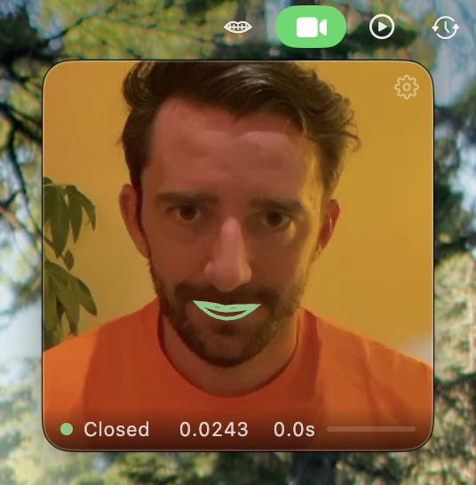
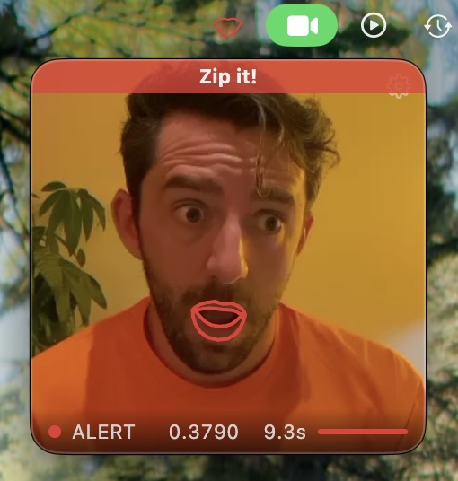

# Zip It

**A gentle nudge to breathe through your nose.**

Mouth breathing is linked to poor sleep, dry mouth, bad breath, and reduced focus. But most of us don't even notice when we're doing it — especially while staring at a screen.

Zip It sits quietly in your macOS menu bar, watching your webcam in the background. When it notices your mouth has been open for a few seconds, it plays a subtle sound to remind you to close it. That's it.

<p align="center">
  
  &nbsp;&nbsp;
  
</p>

## Getting started

```bash
git clone https://github.com/asuth/zip-it.git
cd zip-it
npm install
npm start
```

Requires Node.js and macOS.

On first launch, you'll calibrate the detector to your face — just close your mouth, click Go, then open it slightly, click Go. Takes about 10 seconds.

After that, it runs in the background. Click the menu bar icon to see the live view. Right-click to quit.

## How it works

Zip It uses [MediaPipe Face Landmarker](https://developers.google.com/mediapipe/solutions/vision/face_landmarker) to track 478 facial landmarks in real time through your webcam. It measures mouth openness by comparing the **inner lip polygon area** to the **outer lip polygon area** — a ratio that stays stable regardless of head angle, distance from the camera, or lighting.

When the ratio exceeds your calibrated threshold for 3 consecutive seconds, it plays a synthesized triple-click sound (generated with the Web Audio API — no audio files needed).

The live view shows:
- Lip tracking overlay (green = closed, orange = open, red = alerting)
- Openness ratio and duration
- Progress bar toward the alert threshold
- Dynamic face zoom that smoothly follows your head

Detection continues at 4Hz even when the window is hidden, so you'll always get the alert.

## Privacy and security

**Your camera feed never leaves your computer.** This was a core design goal, not an afterthought.

- All ML inference runs locally via bundled WASM — no network requests, no cloud APIs
- A strict [Content Security Policy](https://developer.mozilla.org/en-US/docs/Web/HTTP/CSP) blocks all outbound connections (`connect-src 'self'`)
- Electron is configured with `sandbox: true`, `contextIsolation: true`, and `nodeIntegration: false`
- Navigation and popup windows are blocked at the process level
- Only 2 IPC channels exist, both one-way, both only toggle UI state (tray icon and window visibility)
- No analytics, no telemetry, no data persistence beyond your calibration threshold (stored in local storage)

You can verify this yourself — the entire app is ~500 lines across 3 files (`main.js`, `preload.js`, `index.html`).

## Built with

- [Electron](https://www.electronjs.org/) — native macOS menu bar app
- [MediaPipe Face Landmarker](https://developers.google.com/mediapipe/solutions/vision/face_landmarker) — real-time face mesh (bundled offline)
- [Web Audio API](https://developer.mozilla.org/en-US/docs/Web/API/Web_Audio_API) — synthesized alert sounds

## License

MIT
